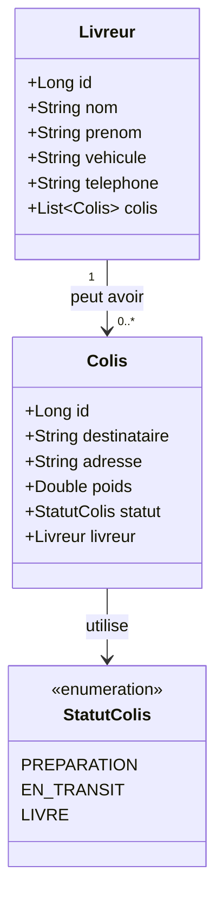

# 📦 Smart Delivery Management System

Application web de gestion de livraisons développée avec **Spring MVC** et **PostgreSQL**.

## 📋 Description

Smart Delivery Management est une API REST permettant de gérer efficacement les livreurs et leurs colis. Le système permet de suivre le statut des livraisons en temps réel et d'optimiser la gestion logistique.

## ✨ Fonctionnalités

- 👤 **Gestion des Livreurs**
  - Créer, consulter, modifier et supprimer des livreurs
  - Associer des colis aux livreurs
  - Consulter l'historique des livraisons

- 📦 **Gestion des Colis**
  - Créer et suivre des colis
  - Mettre à jour le statut (PREPARATION → EN_TRANSIT → LIVRE)
  - Consulter les détails de chaque colis
  - Supprimer des colis

- 🔗 **API REST Complète**
  - Endpoints RESTful (GET, POST, PUT, DELETE)
  - Réponses au format JSON
  - Gestion des erreurs

## 🛠️ Technologies Utilisées

| Technologie | Version | Utilisation |
|------------|---------|-------------|
| Java | 17 | Langage principal |
| Spring MVC | 6.1.0 | Framework web |
| Spring Data JPA | 3.2.0 | Accès aux données |
| Hibernate | 6.4.0 | ORM |
| PostgreSQL | 42.7.1 | Base de données |
| Maven | - | Gestion des dépendances |
| Apache Tomcat | 11.0.11 | Serveur d'application |

## 📁 Structure du Projet

```
src/main/java/com/houssam/Smart_Delivery_Management/
├── controller/      # Controllers REST (API endpoints)
├── service/         # Logique métier
├── repository/      # Accès à la base de données
├── model/          # Entités JPA
└── enums/          # Énumérations (StatutColis)
```

## 🚀 Installation et Démarrage

### Prérequis

- Java 17 ou supérieur
- PostgreSQL 12 ou supérieur
- Apache Tomcat 11
- Maven 3.6+

### Étapes d'installation

1. **Cloner le projet**
```bash
git clone https://github.com/houssamlambara/Smart-Delivery-Management.git
cd Smart-Delivery-Management
```

2. **Créer la base de données PostgreSQL**
```sql
CREATE DATABASE "Smart_Delivery";
```

3. **Configurer la connexion** (si nécessaire)

Modifiez `src/main/webapp/WEB-INF/applicationContext.xml` :
```xml
<property name="url" value="jdbc:postgresql://localhost:5432/Smart_Delivery"/>
<property name="username" value="postgres"/>
<property name="password" value="votre_mot_de_passe"/>
```

4. **Compiler le projet**
```bash
mvnw.cmd clean package
```

5. **Déployer sur Tomcat**

Copiez le fichier `target/SmartDeliverySystem-1.0-SNAPSHOT.war` dans le dossier `webapps/` de Tomcat, puis renommez-le en `Smart_Delivery.war`.

6. **Démarrer Tomcat et tester**
```
http://localhost:8080/Smart_Delivery/api/livreurs
```

## 📡 Documentation API

### URL de base
```
http://localhost:8080/Smart_Delivery/api
```

### Endpoints Livreurs

| Méthode | Endpoint | Description |
|---------|----------|-------------|
| GET | `/livreurs` | Liste tous les livreurs |
| GET | `/livreurs/{id}` | Récupère un livreur par ID |
| POST | `/livreurs` | Crée un nouveau livreur |
| PUT | `/livreurs/{id}` | Modifie un livreur |
| DELETE | `/livreurs/{id}` | Supprime un livreur |

### Endpoints Colis

| Méthode | Endpoint | Description |
|---------|----------|-------------|
| GET | `/colis` | Liste tous les colis |
| GET | `/colis/{id}` | Récupère un colis par ID |
| POST | `/colis?idLivreur={id}` | Crée un nouveau colis |
| PUT | `/colis/{id}` | Modifie le statut d'un colis |
| DELETE | `/colis/{id}` | Supprime un colis |

### Exemples de Requêtes

**Créer un livreur**
```http
POST /api/livreurs
Content-Type: application/json

{
  "nom": "Benali",
  "prenom": "Ahmed",
  "vehicule": "Moto",
  "telephone": "0612345678"
}
```

**Créer un colis**
```http
POST /api/colis?idLivreur=1
Content-Type: application/json

{
  "destinataire": "Mohammed El Fassi",
  "adresse": "123 Rue Mohammed V, Casablanca",
  "poids": 2.5
}
```

**Mettre à jour le statut d'un colis**
```http
PUT /api/colis/1
Content-Type: application/json

{
  "statut": "EN_TRANSIT"
}
```

Statuts disponibles : `PREPARATION`, `EN_TRANSIT`, `LIVRE`

## 🗄️ Modèle de Données



### Livreur
- `id` : Identifiant unique (auto-généré)
- `nom` : Nom du livreur
- `prenom` : Prénom du livreur
- `vehicule` : Type de véhicule (Moto, Voiture, Camionnette)
- `telephone` : Numéro de téléphone
- `colis` : Liste des colis assignés (relation 1-N)

### Colis
- `id` : Identifiant unique (auto-généré)
- `destinataire` : Nom du destinataire
- `adresse` : Adresse de livraison
- `poids` : Poids du colis (en kg)
- `statut` : Statut actuel (PREPARATION, EN_TRANSIT, LIVRE)
- `livreur` : Livreur assigné (relation N-1)

### Relations
- **1 Livreur** peut avoir **plusieurs Colis** (relation 1..N)
- **1 Colis** appartient à **1 seul Livreur** (relation N..1)

## 🏗️ Architecture

Le projet suit une **architecture en couches** :

```
┌─────────────────────────────┐
│   Controller (API REST)     │  ← Gère les requêtes HTTP
├─────────────────────────────┤
│   Service (Logique Métier)  │  ← Logique business
├─────────────────────────────┤
│   Repository (Accès Données)│  ← Interface avec la BD
├─────────────────────────────┤
│   Database (PostgreSQL)     │  ← Stockage persistant
└─────────────────────────────┘
```

## 🤝 Contribution

Les contributions sont les bienvenues ! N'hésitez pas à :
1. Fork le projet
2. Créer une branche pour votre fonctionnalité (`git checkout -b feature/AmazingFeature`)
3. Commiter vos changements (`git commit -m 'Add some AmazingFeature'`)
4. Push vers la branche (`git push origin feature/AmazingFeature`)
5. Ouvrir une Pull Request

## 📝 Licence

Ce projet est sous licence MIT - voir le fichier LICENSE pour plus de détails.

## 👨‍💻 Auteur

**Houssam Lambara**
- GitHub: [@houssamlambara](https://github.com/houssamlambara)

## 🙏 Remerciements

- Spring Framework pour l'excellent framework web
- La communauté Java pour le support et la documentation
- Tous les contributeurs du projet

---

⭐ **N'oubliez pas de mettre une étoile si ce projet vous a été utile !**

